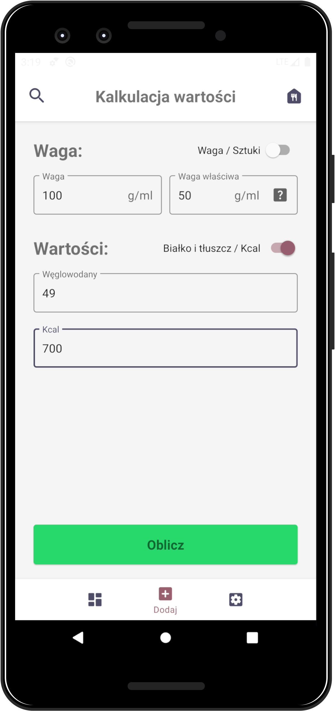
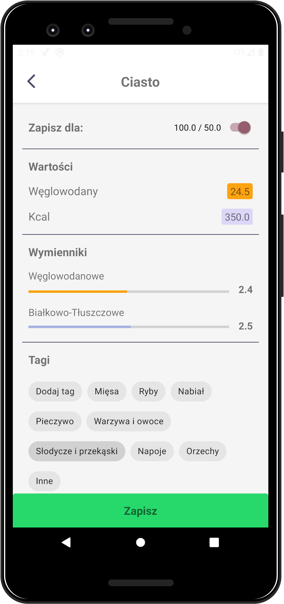
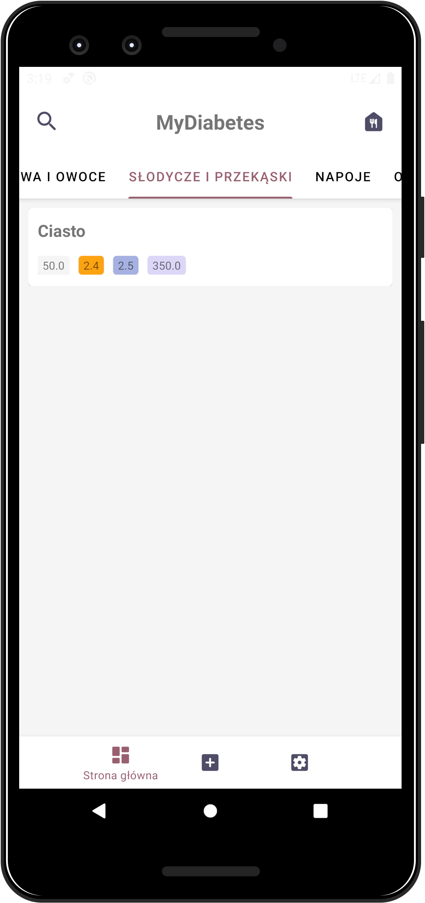
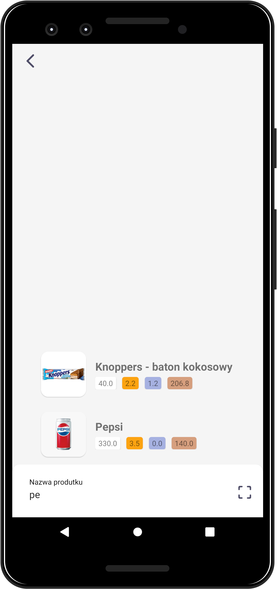

# 💙 MyDiabetes
Application for diabetes that help them calculate carbohydrates and protein-fat exchangers.

Calculator                 |  Product to save Activity | Home                      |  Tag dialog               |     
:-------------------------:|:-------------------------:|:-------------------------:|:-------------------------:|
          |          |          |          |

## 🔍 Table of contents
* [General info](#general-info)
* [Technologies](#technologies)
* [Features](#features)

## 📝 General info
This project is to provide diabetics with faster counting of products and finding them, it will allow you to forget about searching a notebook with stored products and save us from mistakes in calculations. All these factors are supposed to improve the quality of life of the user and help him maintain balanced diabetes.
	
## 🛠 Technologies
Project is created with **Kotlin**.

📚 Libraries (already in use):
* [ROOM](https://developer.android.com/jetpack/androidx/releases/room)
* [Lifecycle](https://developer.android.com/jetpack/androidx/releases/lifecycle)
* Kotlin Coroutines

## 💡 Features
* Easliy calculate carbohydrates and protein-fat exchangers
* Save your products

#### 🎯 TO DO:
* Create pre-database of products (Connection via REST-API)
* Searching by image or barcode
* Food plate (like a cart in shopping sites)

