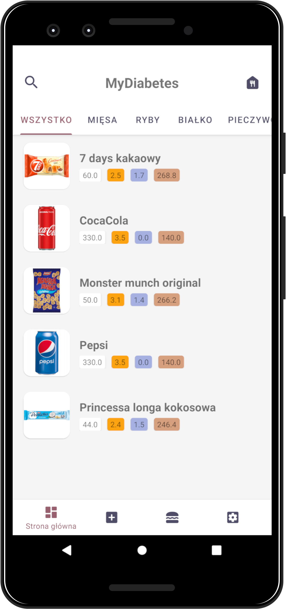
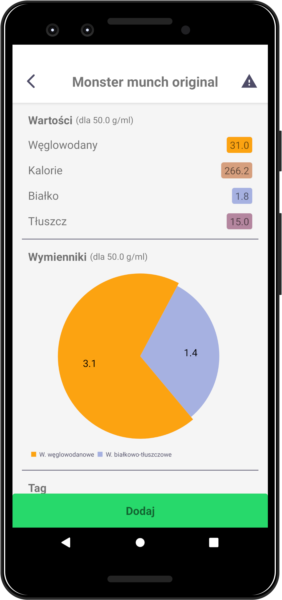
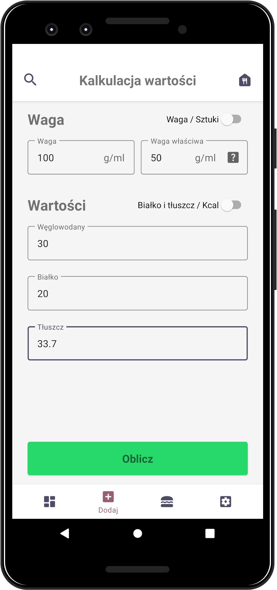
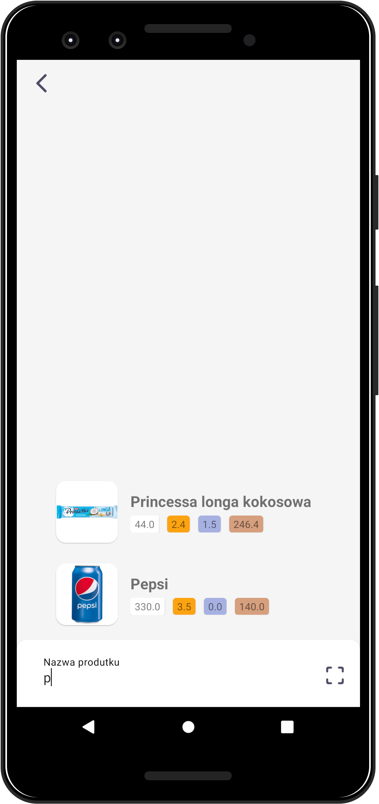
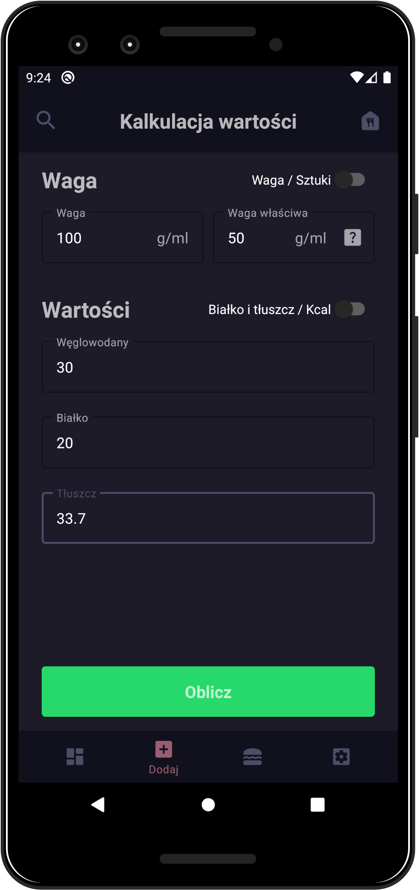

# 💙 MyDiabetes
Application for diabetes that help them calculate carbohydrates and protein-fat exchangers.

<p float="left" align="center">
	
	 
	
	
</p>

## 🔍 Table of contents
* [General info](#-general-info)
* [Calculation methods](#-calculation-methods)
* [Technologies](#-technologies)
* [Features](#-features)
* [Download](#-download)

## 📝 General info
This project is to provide diabetics with faster counting of products and finding them, it will allow you to forget about searching a notebook with stored products and save us from mistakes in calculations. All these factors are supposed to improve the quality of life of the user and help him maintain balanced diabetes.

## 🤓 Calculation methods
There are probably many different calculation methods, those that have been implemented in this application are tested and used by me on a daily basis.

### 🍞 Carbohydrate exchangers
When it comes to carbohydrate exchangers, the matter is very simple. The user gives us carbohydrates and we divide them by 10.

```kotlin
fun carbohydrateExchanges(carbohydrates: Double): Double {
        return roundToOneDecimal(carbohydrates / 10)
}
```

### 🥚 Protein-fat exchangers
In the case of calculating the protein and fat exchangers, we have two options:
* The first option is to calculate the protein and fat values, multiply protein by 4 and fat by 9, add the results together and divide by 100.

```kotlin
fun proteinFatExchangers(protein: Double, fat: Double): Double{
        return roundToOneDecimal((protein * 4 + fat * 9) / 100)
}
```

* The second option is to calculate from the caloric value of the product. Subtracting the carbohydrates multiplied by 4 and dividing the result by 100, this is a faster procedure considering it only requires carbohydrate and caloric values.

```kotlin
fun proteinFatExchangersByCal(cal: Double, carbohydrates: Double): Double{
        return roundToOneDecimal((cal - (carbohydrates * 4) ) / 100)
}
```

ℹ **The end result of the calculation is rounded up to one decimal place**.
	
## 🛠 Technologies
Project is created with **Kotlin** and using **Firebase**.

📚 Libraries (already in use):
* [CameraX](https://developer.android.com/training/camerax)
* [Glide](https://github.com/bumptech/glide)
* [Hilt](https://developer.android.com/training/dependency-injection/hilt-android)
* [Kotlin Coroutines](https://kotlinlang.org/docs/reference/coroutines-overview.html)
* [ML Kit](https://developers.google.com/ml-kit)
* [MPAndroidChart](https://github.com/PhilJay/MPAndroidChart)
* [OkHttp](https://square.github.io/okhttp/)
* [Paging 3](https://developer.android.com/topic/libraries/architecture/paging/v3-overview)
* [Retrofit](https://square.github.io/retrofit/)
* [ROOM](https://developer.android.com/jetpack/androidx/releases/room)

## 💡 Features
* Easliy calculate carbohydrates and protein-fat exchangers
* Save your products
* Searching by barcode
* Food plate (just like shopping cart)
* Support for English and Polish language
* Saving meals
* Creating a common database of products and meals by users

### 🌙 We support dark theme!


#### 🎯 TO DO:
* Searching by image

## ☄ Download
<a href="https://play.google.com/store/apps/developer?id=Bacon+Apps"></a>

